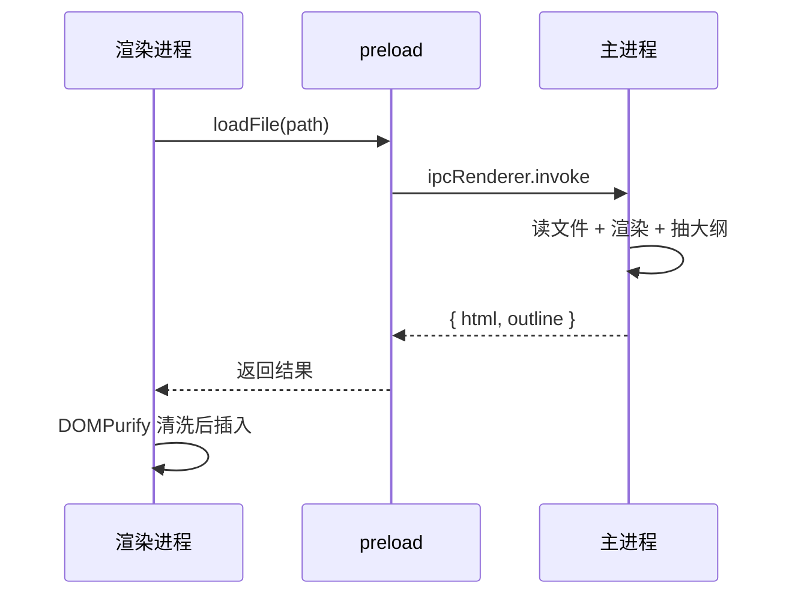

# Junky Markdown Reader 示例文档

这份文档把阅读器支持的语法都用了一遍，可以拿它检查渲染效果和主题是否正常。

## 一、基础排版

这是一个普通段落，中英文混排的效果在这里可以看出来：Markdown is a lightweight markup language，行高与标点间距都针对中文阅读调整过。

**粗体**、*斜体*、~~删除线~~、`行内代码`、[外部链接](https://github.com)、以及一个脚注引用[^1]。

[^1]: 这是脚注的内容，会渲染到文档最底部。

> 引用块的样式。
> 多行引用会合并成一段。
>
> — 某位不存在的作者

***

### 1.1 三级标题

### 1.2 另一个三级标题

用来测试大纲侧栏的层级缩进和滚动高亮。

## 二、列表

无序列表：

- 第一项
- 第二项
  - 嵌套的子项
  - 另一个子项
- 第三项

有序列表：

1. 第一步
2. 第二步
3. 第三步

任务列表：

- [x] 已完成的事项
- [x] 另一件已完成的
- [ ] 还没做的事项
- [ ] 又一件没做的

## 三、代码高亮

JavaScript：

```javascript
// 斐波那契数列
function fib(n) {
  const memo = new Map([[0, 0], [1, 1]]);
  const walk = (k) => {
    if (memo.has(k)) return memo.get(k);
    const value = walk(k - 1) + walk(k - 2);
    memo.set(k, value);
    return value;
  };
  return walk(n);
}

console.log(fib(50)); // 12586269025
```

Python：

```python
from dataclasses import dataclass

@dataclass
class Note:
    title: str
    tags: list[str]

    def slug(self) -> str:
        return self.title.strip().lower().replace(" ", "-")
```

没有指定语言的代码块：

```
这段不会被高亮，
原样输出。
```

一段特别长的代码，用来检查代码块能不能横向滚动而不是把整个页面撑破：

```bash
docker run --rm -it --name very-long-container-name -v /some/really/long/host/path:/container/path -e SOME_ENVIRONMENT_VARIABLE=value --network host ubuntu:24.04 bash -lc "echo hello"
```

## 四、表格

| 方案 | 安装包体积 | 内存占用 | 适配度 |
|---|---:|---:|:---:|
| Electron | ~120 MB | ~300 MB | 最佳 |
| Tauri 2 | ~10 MB | ~100 MB | 一般 |
| C# / WPF | ~5 MB | ~60 MB | 不推荐 |
| Qt | ~25 MB | ~80 MB | 不推荐 |

## 五、Mermaid 图表

流程图：


时序图：



一个故意写错的图表，用来检查错误处理会不会把整个页面搞崩：

```mermaid
flowchart TD
    A[未闭合的括号 --> B{{{
```

## 六、图片

本地相对路径的图片（`./assets/` 下的示例图，用来验证 `md-asset://` 协议是否正常工作）：


网络图片（需要联网，加载不出来是正常的）：


图片可以点击放大。

## 七、本地文档跳转

- [跳到本文档的第三节](#三代码高亮)
- [打开同目录下的另一份文档](./另一份文档.md)

## 八、长内容

下面是一些填充段落，用来测试滚动、大纲高亮跟随、以及底部留白是否舒服。

### 8.1 段落组 A

阅读器的正文区背景色由 Typora 主题的 `body` 规则决定，而工具栏和侧栏用的是应用自己的一套配色变量。这样切换主题时，正文的观感完全由主题掌控，外壳则始终保持一致。

这个设计的代价是：主题作者若在 `body` 上写了 `!important`，外壳可能会被影响。实测里这种情况很少见。

### 8.2 段落组 B

Markdown 的解析与渲染都发生在主进程，渲染进程只接收 HTML 字符串。这样做的直接好处是渲染进程里完全不需要加载任何 npm 包，也就不用应付 ESM 与 bare specifier 那一堆问题。

代价是每次打开文档要走一次 IPC，但对阅读器来说这个延迟完全无感。

### 8.3 段落组 C

文件监听只盯着当前打开的那一个文件。在别的编辑器里改完保存，阅读器会自动刷新并保持滚动位置。整个知识库目录不做递归监听 —— 在大目录上那个开销很难看，收益却很小。

### 8.4 段落组 D

安全上有三道措施：渲染进程开了 `contextIsolation` 且关闭了 `nodeIntegration` 和 Node 集成；渲染结果一律过 DOMPurify，夹带的 `<script>` 会被剥掉；本地资源走 `md-asset://` 协议且有目录白名单，文档没办法读到白名单外的文件。
